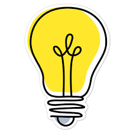

# Lista Ekwipunku Górskiego

Poniżej znajduje się propozycja co spakować w góry. Poniższa lista jest orientacyjna, należy zmodyfikiwać ją w zależności od pory roku, pasma górskiego itp. (więcej wskazówek na dole strony).

<h3 class="bg-greyBase p-2">Aby przeczytać więcej nt. danej kategorii ekwipunku kliknij tytuł listy</h3>

<blockquote class="my-4 w-full">
    

    
    

        Wydrukuj tą listę. Po powrocie do domu popatrz na nią jeszcze raz- wykreśl rzeczy, które Ci się nie przydały, dopisz rzeczy, których żałujesz że nie wziąłeś. 
        Aktualizuj listę po każdej wyprawie górskiej a wkrótce stworzysz swój wymarzony ekwipunek!
    

    

</blockquote>

 

<small class="p-2">(lista scrapowana ze strony: https://www.goromaniacy.pl/2017/07/jak-sie-spakowac-na-wyjazd-w-gory-i.html#)</small>

    

    

        
<a href="/KGprojects/odziez.html"><h2 clas="p-6">Odzież</h2></a>

        <ul class="pl-10 p-4">
            <li class="pl-2"> obuwie</li>
            <li class="pl-2"> japonki/klapki</li>
            <li class="pl-2"> spodnie/pasek/getry</li>
            <li class="pl-2"> koszulki</li>
            <li class="pl-2"> bielizna/skarpetki</li>
            <li class="pl-2"> kurtka przeciwdeszczowa</li>
            <li class="pl-2"> peleryna przeciwdeszczowa</li>
            <li class="pl-2"> polar</li>
            <li class="pl-2"> cienka bluza/kamizelka</li>
            <li class="pl-2"> nakrycie głowy/buff</li>
            <li class="pl-2"> piżama</li>
            <li class="pl-2"> stuptuty</li>
            <li class="pl-2"> ręcznik</li>
        </ul>
    

    

    

        
<a href="/KGprojects/apteczka.html"><h2 clas="p-6">Apteczka</h2></a>

        <ul class="pl-10 p-4">
            <li class="pl-2"> leki, które przyjmujesz na stałe</li>
            <li class="pl-2"> leki przeciwbólowe/rozkurczowe/na dolegliwości żołądkowe</li>
            <li class="pl-2"> plastry</li>
            <li class="pl-2"> bandaż elastyczny</li>
        </ul>
    

    

        
<a href="/KGprojects/dokumenty.html"><h2 clas="p-6">Dokumenty</h2></a>

        <ul class="pl-10 p-4">
            <li class="pl-2"> dowód osobisty/paszport</li>
            <li class="pl-2"> ubezpieczenie (wyjazd zagraniczny)</li>
            <li class="pl-2"> legitymacja</li>
            <li class="pl-2"> bilety na autobus/pociąg/samolot</li>
            <li class="pl-2"> gotówka/karta płatnicza</li>
        </ul>
    

    

    

    

        
<a href="/KGprojects/prowiant.html"><h2 clas="p-6">Prowiant</h2></a>

        <ul class="pl-10 p-4">
            <li class="pl-2"> kabanosy</li>
            <li class="pl-2"> pasztet/konserwy</li>
            <li class="pl-2"> zupki chińskie</li>
            <li class="pl-2"> pieczywo</li>
            <li class="pl-2"> czekolada/chałwa</li>
            <li class="pl-2"> batony energetyczne/orzechy/suszone owoce</li>
            <li class="pl-2"> herbata/kawa/cukier</li>
        </ul>
    

    

    

        
<a href="/KGprojects/kosmetyczka.html"><h2 clas="p-6">Kosmetyczka</h2></a>

        <ul class="pl-10 p-4">
            <li class="pl-2"> żel pod prysznic</li>
            <li class="pl-2"> szampon</li>
            <li class="pl-2"> dezodorant</li>
            <li class="pl-2"> pasta do zębów/szczoteczka</li>
            <li class="pl-2"> krem z filtrem</li>
            <li class="pl-2"> pomadka ochronna</li>
            <li class="pl-2"> okulary przeciwsłoneczne</li>
            <li class="pl-2"> żel antybakteryjny</li>
            <li class="pl-2"> chusteczki nawilżone/chusteczki</li>
            <li class="pl-2"> szczotka/grzebień</li>
            <li class="pl-2"> spray na owady/maść po ukąszeniach</li>
            <li class="pl-2"> papier toaletowy</li>
            <li class="pl-2"> podpaski/tampony</li>
        </ul>
    
 
    

        
<a href="/KGprojects/pozostale.html"><h2 clas="p-6">Pozostałe</h2></a>

        <ul class="pl-10 p-4">
            <li class="pl-2"> mapa</li>
            <li class="pl-2"> aparat fotograficzny/statyw</li>
            <li class="pl-2"> baterie/akumulatory/ładowarka</li>
            <li class="pl-2"> karty pamięci</li>
            <li class="pl-2"> ładowarka do telefonu</li>
            <li class="pl-2"> czołówka</li>
            <li class="pl-2"> scyzoryk</li>
            <li class="pl-2"> kijki</li>
            <li class="pl-2"> powerbank</li>
            <li class="pl-2"> śpiwór/karimata</li>
            <li class="pl-2"> butelka na wodę/bukłak</li>
            <li class="pl-2"> termos/kubek termiczny</li>
            <li class="pl-2"> sztućce turystyczne</li>
            <li class="pl-2"> podręczny plecak</li>
            <li class="pl-2"> karty do gry</li>
            <li class="pl-2"> poduszka turystyczna</li>
        </ul>
    

  
