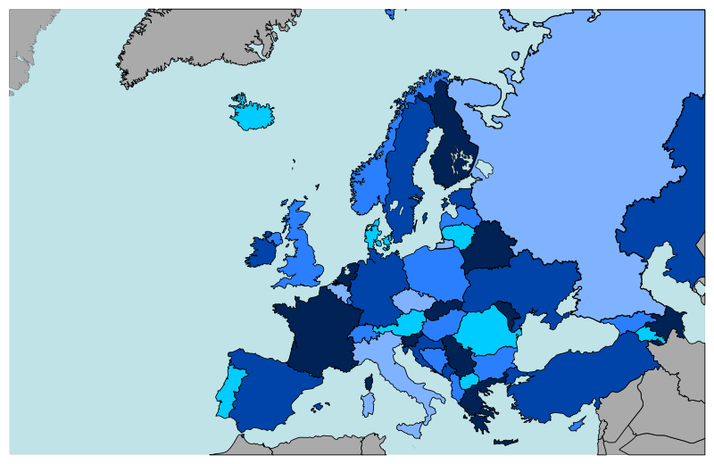

<h1 class="w-full bg-greyBase text-center py-10 m-4 -mb-8"> Co należy przygotować jadąc w góry?</h1>

    To niełatwe zadanie, a więc postanowiliśmy Ci to ułatwić:
    <ol class="list-roman ml-10">
        <li>Skorzystaj z naszej listy zadań do zrobienia, aby upewnić się, że niczego nie przeoczyłeś.</li>
        <li>Jeśli szukasz inspiracji w sprawie celu podróży: sprawdź propozycje tras i mapkę na dole strony.</li>
        <li>Sprawdź nasz <a href="ekwipunek.html">poradnik "jak się  spakować"</a>. Oprócz poradnika pakowania znajdziesz tam wiele wskazówek przydatnych podczas całej podróży.</li>
        <li>Jeśli masz dodatkowe pytania <a href="kontakt.html">skontaktuj się z nami!</a></li>
    </ol>
 

<h3>Zadania do zrobienia:</h3>
<!-- Checklista z zadaniami -->

    

        <label><input type="checkbox" class="zadanie"> Wybranie celu podróży</label>
        <label><input type="checkbox" class="zadanie"> Sprawdź, czy jest dopasowany do Twoich umiejętnosci i dostępnych środków transportu</label>
        <label><input type="checkbox" class="zadanie"> Zaplanuj trasę</label>
        <label><input type="checkbox" class="zadanie"> Zaplanuj dojazd</label>
        <label><input type="checkbox" class="zadanie"> Zaplanuj jedzenie i picie (ile ze sobą weźmiesz i gdzie uzupwłnisz)</label>
        <label><input type="checkbox" class="zadanie"> Zarezerwuj nocleg lub zaplanuj miejsce biwakowe pod namiotem</label>
        <label><input type="checkbox" class="zadanie"> Przygotuj resztę ekwipunku</label>
    

    

        <label for="postep" class="text-center">Postęp:</label>
        <progress id="postep" value="0" max="100">0%</progress>
        
Aktualny postęp: 0%

    

 
 
<h2 class="text-center"> Nie wiesz w jakie góry jechać? Sprawdź poniżej:</h2>

    <iframe style="border:none" src="https://en.frame.mapy.cz/s/pugotazeto" width="600" height="333" frameborder="0"></iframe>

 

    <table class="w-full">
    <caption class="caption-top"><h3>Poniżej tabela z propozycjami tras</h3> </caption>
    <thead class="bg-almostWhite border-b-2 border-grayBrown">
        <tr>
            <th class="w-50 p-3 text-sm tracking-wide text-left whitespace-nowrap">Pasmo górskie </th>
            <th class="min-w-[30px] p-3 text-sm tracking-wide text-left whitespace-nowrap"> GOT</th>
            <th class="min-w-[40px] p-3 text-sm tracking-wide text-left whitespace-nowrap">Nocleg pod dachem </th>
          <th class="min-w-[40px] p-3 text-sm tracking-wide text-left whitespace-nowrap">Dostęp do wody</th>
          <th class="min-w-[40px] p-3 text-sm tracking-wide text-left whitespace-nowrap"> Dojazd pociągiem </th>
          <th class="min-w-[40px] p-3 text-sm tracking-wide text-left whitespace-nowrap"> Trasa </th>
        </tr>
    </thead>
    <tbody>
        <tr class="odd:bg-white even:bg-greyBase">
            <td class="p-3 text-sm tracking-wide text-left whitespace-nowrap whitespace-nowrap"> Pieniny </td>
            <td class="p-3 text-sm tracking-wide text-left whitespace-nowrap">40</td>
            <td class="p-3 text-sm tracking-wide text-left whitespace-nowrap"> nie  </td>
            <td class="p-3 text-sm tracking-wide text-left whitespace-nowrap"> tak</td>
            <td class="p-3 text-sm tracking-wide text-left whitespace-nowrap">tak </td>
            <td class="w-65 p-3 text-sm tracking-wide text-left whitespace-nowrap">tu opis trasy 1 </td>
        </tr>
        <tr class="odd:bg-white even:bg-greyBase">
            <td class="p-3 text-sm tracking-wide text-left whitespace-nowrap">Beskid Mały </td>
            <td class="p-3 text-sm tracking-wide text-left whitespace-nowrap">24 </td>
            <td class="p-3 text-sm tracking-wide text-left whitespace-nowrap">tak  </td>
            <td class="p-3 text-sm tracking-wide text-left whitespace-nowrap"> tak</td>
            <td class="p-3 text-sm tracking-wide text-left whitespace-nowrap"> tak </td>
            <td class="w-65 p-3 text-sm tracking-wide text-left whitespace-nowrap">tu opis trasy 2 </td>
        </tr>
        <tr class="odd:bg-white even:bg-greyBase">
            <td  class="p-3 text-sm tracking-wide text-left whitespace-nowrap" rowspan="2">Beskid Żywiecki</td>
            <td class="p-3 text-sm tracking-wide text-left whitespace-nowrap">53</td>
            <td class="p-3 text-sm tracking-wide text-left whitespace-nowrap">nie</td>
            <td class="p-3 text-sm tracking-wide text-left whitespace-nowrap">tak</td>
            <td class="p-3 text-sm tracking-wide text-left whitespace-nowrap">nie</td>
            <td class="w-65 p-3 text-sm tracking-wide text-left whitespace-nowrap">tu opis trasy 3</td>
        </tr>
        <tr class="odd:bg-white even:bg-greyBase">
            <td class="p-3 text-sm tracking-wide text-left whitespace-nowrap">60</td>
            <td class="p-3 text-sm tracking-wide text-left whitespace-nowrap">nie</td>
            <td class="p-3 text-sm tracking-wide text-left whitespace-nowrap">nie</td>
            <td class="p-3 text-sm tracking-wide text-left whitespace-nowrap">nie</td>
            <td class="p-3 text-sm tracking-wide text-left whitespace-nowrap">opis trasy 4</td>
        </tr>
        <tr class="odd:bg-white even:bg-greyBase">
            <td class="p-3 text-sm tracking-wide text-left whitespace-nowrap">Bieszczady</td>
            <td class="p-3 text-sm tracking-wide text-left whitespace-nowrap"> 56</td>
            <td class="p-3 text-sm tracking-wide text-left whitespace-nowrap">tak</td>
            <td class="p-3 text-sm tracking-wide text-left whitespace-nowrap">tak</td>
            <td class="p-3 text-sm tracking-wide text-left whitespace-nowrap">tak</td>
            <td class="p-3 text-sm tracking-wide text-left whitespace-nowrap">opis trasy 5 </td>
        </tr>
    </tbody>
    <tfoot>
        <tr>
            <td  class="p-3 text-sm tracking-wide text-left whitespace-nowrap" colspan="6">Więcej informacji: link</td>
        </tr>
    </tfoot>
</table>

 

    <h2>Trasy poza Polską:</h2>
    

        <h3>Interaktywna Mapa Europy</h3>
        
Kliknij na wybrany kraj, aby dowiedzieć się więcej: (na ten moement działa link tylko do Portugali, Niemiec i Ukrainy)

        <!--mapa-->
        
        <map name="europemap">
        <!-- Obszar 1: Ukraina -->
        <area shape="rect" coords="400,200,450,250" alt="Polska" href="https://uk.wikipedia.org/wiki/%D0%A3%D0%BA%D1%80%D0%B0%D1%97%D0%BD%D0%B0" target="_blank" title="Ukraina">
        <!-- Obszar 2: Niemcy -->
        <area shape="circle" coords="300,250,30" alt="Niemcy" href="https://de.wikipedia.org/wiki/Deutschland" target="_blank" title="Niemcy">
        <!-- Obszar 3: Portugalia -->
        <area shape="poly" coords="150,300,200,350,250,300,200,250" alt="Francja" href="https://pt.wikipedia.org/wiki/Portugal" target="_blank" title="Portugalia">
        </map>
        
<small>Mapa pochodzi z <a href="https://commons.wikimedia.org/wiki/File:Europe_countries.svg" target="_blank">Wikimedia Commons</a>.</small>

    

<!-- Podłącz zewnętrzny plik JavaScript -->

