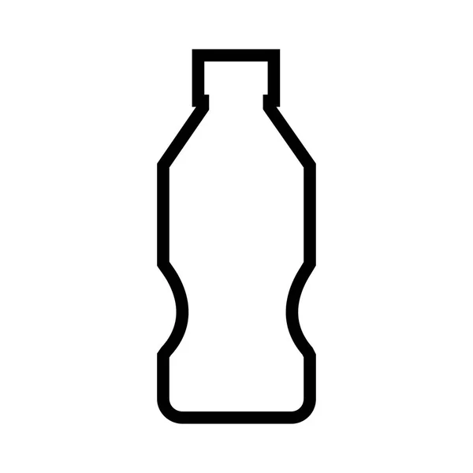

## Szybkie do przygotowania lub już gotowe, najlepiej do chwycenia w dłoń i maszerowania dalej w trakcie jedzenia, czyli o tym, co spakować do jedzenia na szlaku.

## Spakuj na przykład:

- kabanosy
- pasztet/konserwy
- zupki chińskie
- pieczywo
- czekolada/chałwa
- batony energetyczne/orzechy/suszone owoce
- herbata/kawa/cukier

### Dostosuj powyższe propozycje do swojej diety, jednak pamiętaj: podczas chodzenia po górach zużyjesz dużo enegii. [Sprawdź jakie jest Twoje dzienne zapotrzebowanie kaloryczne](https://musclepower.pl/Kalkulator-kalorii-cabout-pol-2448.html#:~:text=Doros%C5%82y%20cz%C5%82owiek%2C%20kt%C3%B3ry%20nie%20podejmuje,wynosi%20oko%C5%82o%201800%20%2D%202400%20kalorii.) i dodaj do niego jeszcze 20%.

Zadbaj, by mieć ze sobą odpowiednio dużo jedzenia. Warto, żeby rzeczy, które spakujesz miały w sobie dużo białka.

## Warto zaplanować conajmniej jeden ciepły posiłek podczas dnia. Jeśli śpisz na dziko przyda Ci się palnik. Jeśli planujesz ognisko: sprawdź czy na miejscu noclegowym wolno je rozpalić.

 

<blockquote>
    

    
    

        Ceny jedzenia w schronisku potrafią być drogie, jednak dużo schronisk udostępnia za darmo wrzątek. To oznacza możliwość zjedzenia zabranej z domu: zupki chińskiej, owsianki, herbatki lub kawy.   Sprawdź w internecie, czy schronisko w którym się zatrzymujesz oferuje darmowy wrzątek!
    

    

</blockquote>
 

# Oprócz jedzenia pamiętaj o piciu!

    <h3 style= "padding: 10px;">
        Dziennie człowiek powinien pić conajmniej 2L   Wysiłek fizyczny= większe pragnienie- spakuj co najmniej 2,5L/ dizeń   Przemyśl, gdzie podczas trasy, będziesz mógł ponownie wypełnić swoją butelkę z wodą (z częście strumyków górskich można bezpiecznie czerpać wodę).
    </h3>

 

### Jeśli jesteś prawdziwym hardcorem możesz spróbować przyrządzić obiad z darów lasu (jednak polecam mieć zapasowy prowiant w razie, gdybyś nic jadalnego nei znalazł):

    <iframe width="560" height="315" src="https://www.youtube.com/embed/-hHs4jgLZ_Y?si=R-0Eqblt35oIMWvH" title="YouTube video player" frameborder="5" allow="accelerometer; autoplay; clipboard-write; encrypted-media; gyroscope; picture-in-picture; web-share" referrerpolicy="strict-origin-when-cross-origin; margin-left: 100px" allowfullscreen></iframe>

 

## Przeczytaj więcej:

wybrane za pomocą googlesarch

- [https://www.prowiant.pl/?srsltid=AfmBOopTML_SsYcE83xJI6p-hBqgueeAHDTk40rmy6R2aF1jUd1Z3w1W](https://www.prowiant.pl/?srsltid=AfmBOopTML_SsYcE83xJI6p-hBqgueeAHDTk40rmy6R2aF1jUd1Z3w1W)
- [https://pl.wiktionary.org/wiki/prowiant](https://pl.wiktionary.org/wiki/prowiant)
- [https://wsjp.pl/haslo/podglad/90360/prowiant](https://wsjp.pl/haslo/podglad/90360/prowiant)
- [https://synonim.net/synonim/prowiant](https://synonim.net/synonim/prowiant)
- [https://sjp.pl/prowiant](https://sjp.pl/prowiant)
- [https://www.helpa.pl/sklep/suchy-prowiant](https://www.helpa.pl/sklep/suchy-prowiant)
